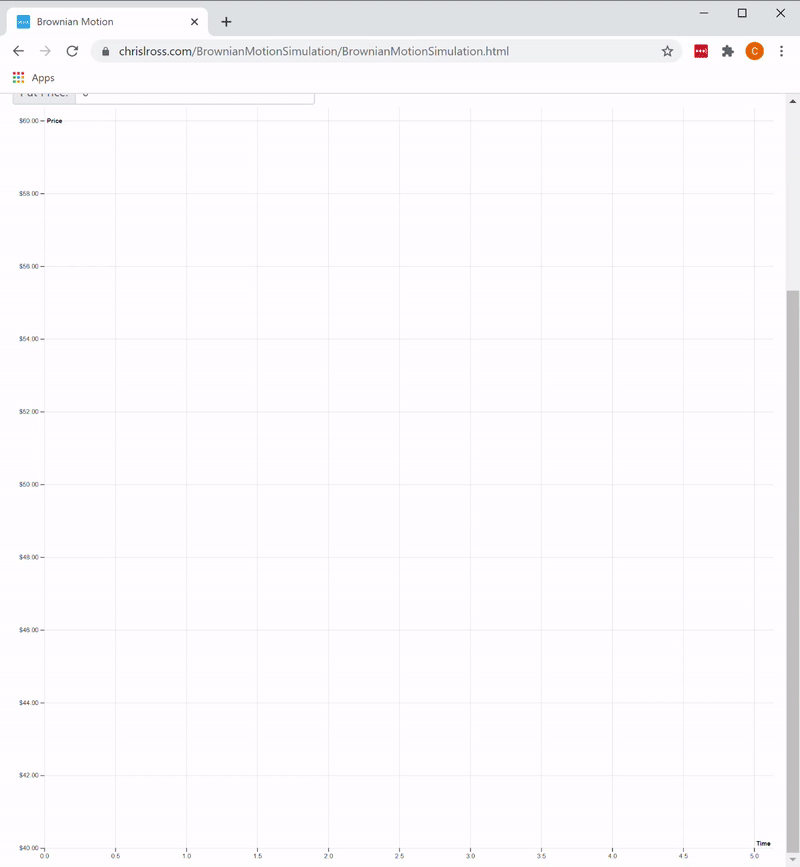
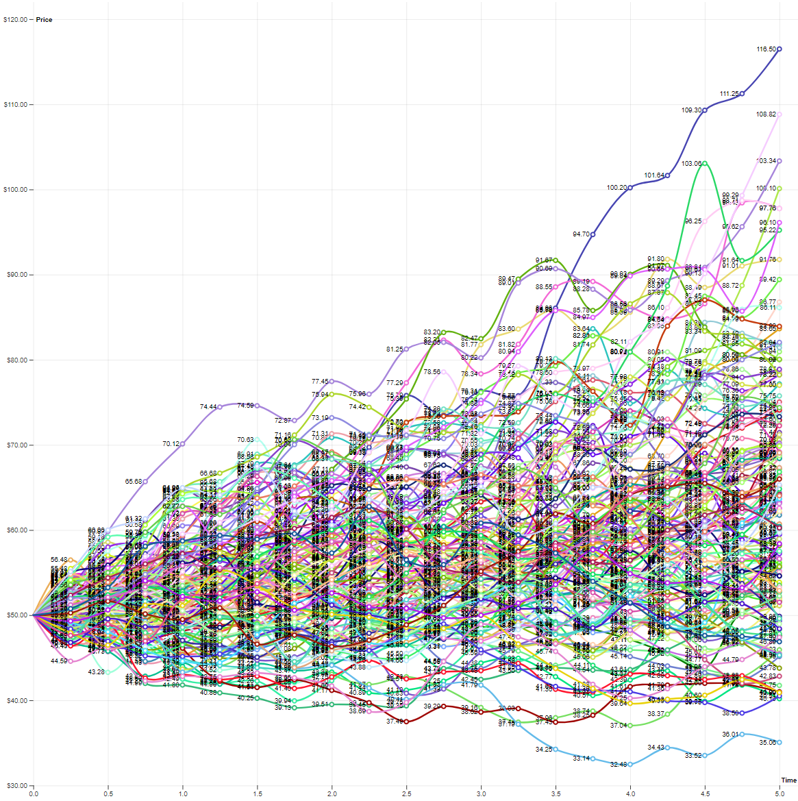

# BrownianMotionSimulation

An interactive visualization of the stock price paths generated during a Monte Carlo simulation for option pricing

---

### [Try it out](https://www.chrislross.com/BrownianMotionSimulation/)

---

## Examples

#### Running a small number of paths with high volatility

#### Running a large number of paths

